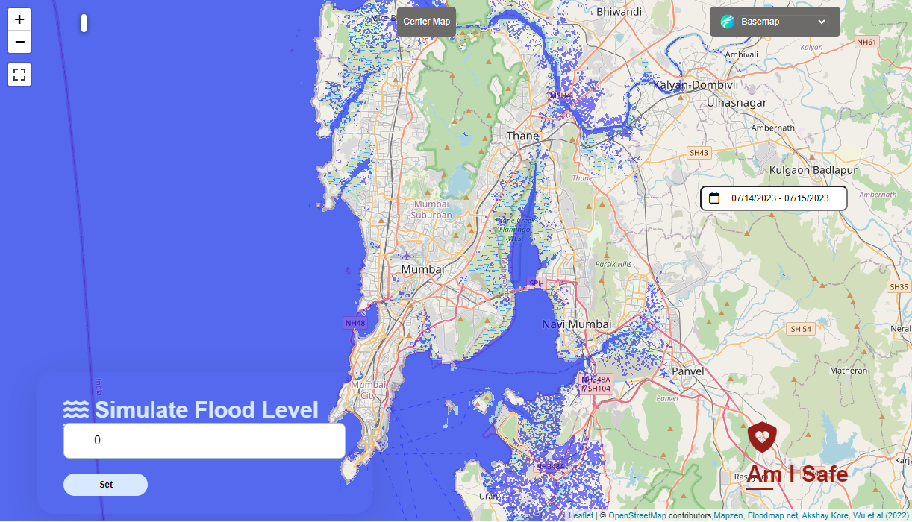

# Backend Solution for Singapore India Hackathon 2023

Contributors in Alphabetical order:
- Bao Lam Ngyuen
- Bhavyta Aggarwal
- Keshav Agarwal
- Pak Hui Ying

## EduFlood+ (backend)
- **Flood Simulator**, where users can enter any flood level to simulate flood extent
- **"Am I Safe" module**, where users can check if their current location is at risk of flood at a given simulated flood levels of one and two meters, and at any location in the world
- Data sets/layers for Mumbai include:
    - Population density
    - Digital Elevation Map (DEM)
    - Land subsidence
    - Land use map (residential, slums, commercial, industrial)
    - Past historical flood extent (July 2005)
    - Mumbai past flood inventory
    - Vulnerability map
    - Vulnerability classification
    - Crowd-sourced data
    - Flood shelters

## UI Interface
